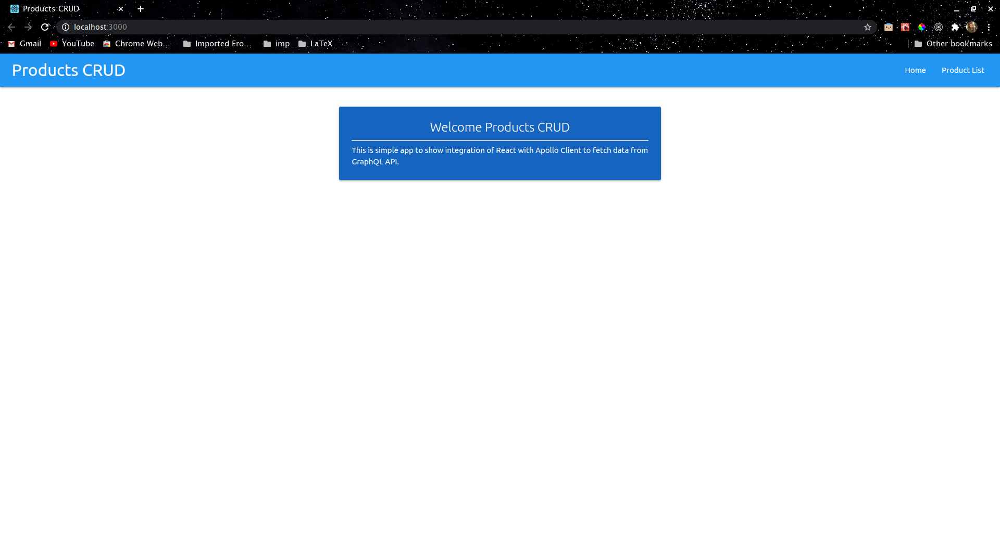
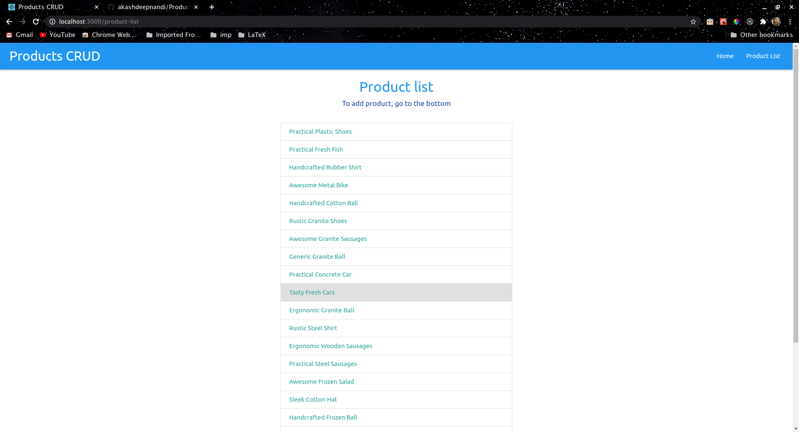
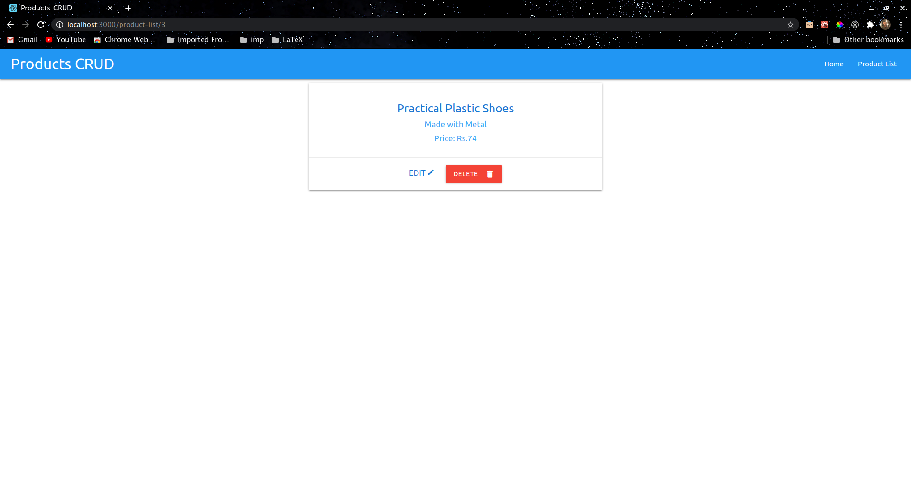
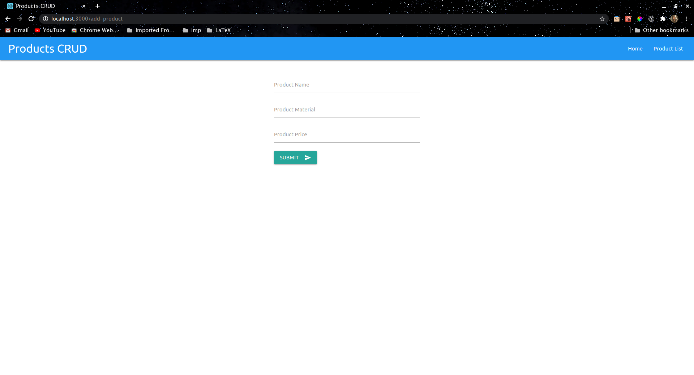

# Product CRUD with React and GraphQL

<br />
<br />
This is an Web App, Front-End made with React.js and backend is a GraphQL API.

- For client interaction with GraphQL, apollo-client has been used.
- For database an mock api created by [mockapi.io](https://www.mockapi.io/) is used.
- This is simple started project to show the creation of GraphQL API with apollo server
- Also to showcase the basic steps of integration of GraphQL API with React.js Front-End. 
---
### API Documentation: 

API is self documentated, thanks to GraphQL. It is just using a single resources products. Sample GrahpQL Query.

```js
query getProducts {
	products {
		id
		name
		material
	}
}
```
---
### Usage:

You can start using this application just by running to four simple steps, after downloading the project and navigating to project directory

- Install server dependencies
	```
	npm i
	```
- Start server
	```
	npm start
	```
- Navigate to client directory and run this to install client dependencies(make sure you have yarn installed)
	```
	yarn install
	```
- Start running the client
	```
	yarn start
	```
---
### Screenshots:

<p align="center">Home Page</p>

<p align="center">Product List Page</p>

<p align="center">Product Details Page</p>

<p align="center">Add Product Page</p>

----